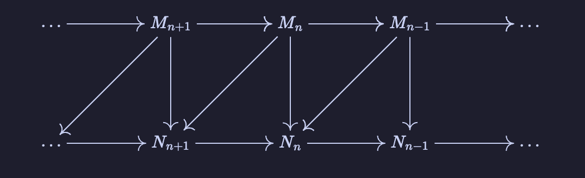
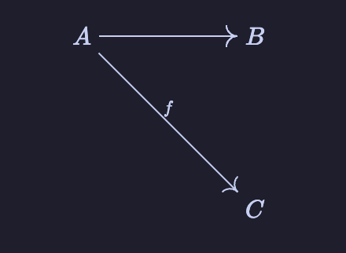

# Obsidian Commutative Diagram

A plugin for Obsidian that renders commutative diagrams using `tikzcd` syntax. Supports diagonal arrows and arrow labels!



## Example 

````
```tikzcd
A \arrow[dr,"f"] & B \\
&C
```
````

produces



Currently, the only valid arguments in `\arrow[...]` are the direction (i.e. any permutation of `lrud`) and the label, which must be quoted with `"`. 

## Supported features

- All Latex symbols supported by Obsidian
- Labels on arrows
- Horizontal, vertical, and diagonal arrows

## Work-in-progress features

- Proper position of arrow labels
- More arrow/arrowhead types
- Curved arrows